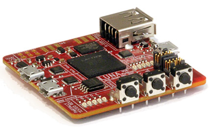

# SOL: a USB multitool & Torii HDL library

## SOL Library

SOL is a full toolkit for working with USB using FPGA technology; and provides hardware, gateware, and software to enable USB applications.

Some things you can use SOL for, currently:

- **Protocol analysis for Low-, Full-, or High- speed USB.** SOL provides both hardware designs and gateware that allow passive USB monitoring. When combined with the [ViewSB](https://github.com/usb-tools/viewsb) USB analyzer
  toolkit, SOL hardware+gateware can be used as a full-featured USB analyzer.
- **Creating your own Low-, Full-, High-, or (experimentally) Super- speed USB device.** SOL provides a collection of Torii gateware that allows you to easily create USB devices in gateware, software, or a combination of the two.
- **Building USB functionality into a new or existing System-on-a-Chip (SoC).** SOL is capable of generating custom peripherals targeting the common Wishbone bus; allowing it to easily be integrated into SoC designs; and the library provides simple automation for developing simple SoC designs.

Some things you'll be able to use SOL for in the future:

- **Man-in-the-middle'ing USB communications.** The SOL toolkit will be able to act
  as a *USB proxy*, transparently modifying USB data as it flows between a host and a device.
- **USB reverse engineering and security research.** The SOL toolkit will serve as an ideal
  backend for tools like [FaceDancer](https://github.com/usb-tools/facedancer); allowing easy
  emulation and rapid prototyping of compliant and non-compliant USB devices.

## SOL Hardware

The SOL project also includes eponymous multi-tool hardware. This hardware isn't yet suited for end-users; but hardware development has reached a point where current-revision boards (r0.2+) make good development platforms for early community developers.

Building this board yourself isn't for the faint of heart -- as it requires placing two BGA components, including a large FPGA. Still, if you're proficient with rework and FPGA development, feel free to join in the fun!

## Project Structure

This project is broken down into several directories:

* `sol` -- the primary SOL python toolkit; generates gateware and provides USB functionality
  * `sol/gateware` -- the core gateware components for SOL; and utilities for stitching them together
* `examples` -- simple SOL-related examples; mostly gateware-targeted, currently
* `docs` -- sources for the SOL Sphinx documentation
* `contrib` -- contributed/non-core components; such as udev rules
* `applets` -- pre-made gateware applications that provide useful functionality on their own (e.g., are more than examples)

## Project Documentation

SOL's documentation is captured on [Read the Docs](https://SOL.readthedocs.io/en/latest/). Raw documentation sources
are in the `docs` folder.

## Related Projects

SOL hardware is supported by two firmware projects:

* [Apollo](https://github.com/greatscottgadgets/apollo/), the firmware that runs on SOL hardware's debug controller,
  and which is responsible for configuring its FPGA.
* [Saturn-V](https://github.com/greatscottgadgets/saturn-v/), a DFU bootloader created for SOL hardware.
