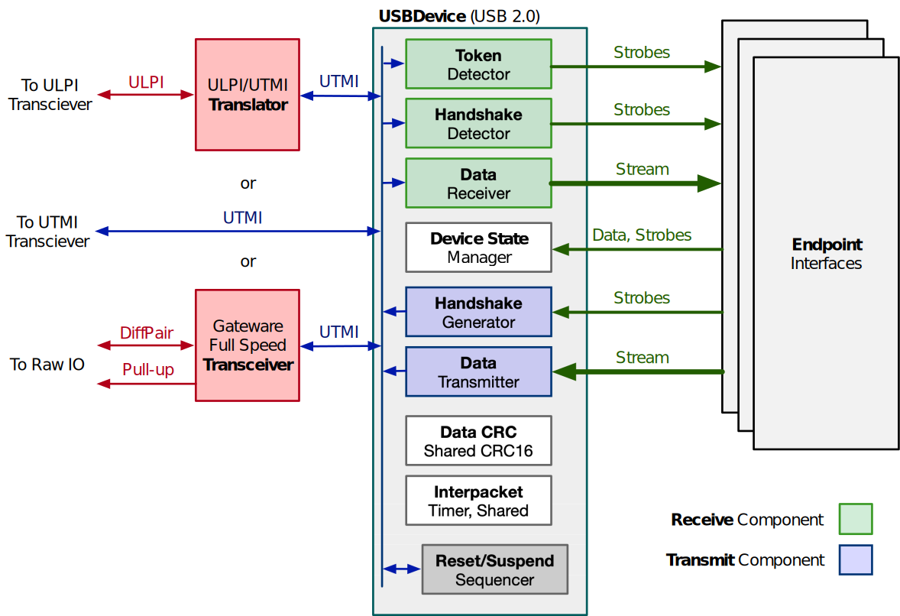

# Endpoint

# Gateware Endpoint Interfaces

The Torii-USB architecture separates gateware into two distinct groups: the *core device*, responsible for the
low-level communications common to all devices, and *endpoint interfaces*, which perform high-level communications,
and which are often responsible for tailoring each device for its intended application:



Every useful Torii-USB device features at least one endpoint interface capable of at least handling enumeration. Many
devices will provide multiple endpoint interfaces -- often one for each endpoint -- but this is not a requirement.
Incoming token, data, and handshake packets are routed to all endpoint interfaces; it is up to each endpoint interface
to decide which packets to respond to.

	*Note: terms like "interface" are overloaded: the single term "interface" can refer both to hardware interfaces
	and to the USB concept of an Interface. The "interface" in "endpoint interface" is an instance of the former;
	they are conceptually distinct from USB interfaces. To reduce conflation, we'll use the full phrase "endpoint
	interface" in this document.*

As a single endpoint interface may handle packets for multiple endpoints; it is entirely possible to have a device
that talks on multiple endpoints, but which uses only one endpoint interface.

## Exclusivity


A Torii-USB ``USBDevice`` performs no arbitration -- if two endpoint interfaces attempt to transmit at the same time, the
result is undefined; and often will result in undesirable output. Accordingly, it's important to ensure a "clear
delineation of responsibility" across endpoint interfaces. This is often accomplished by ensuring only one endpoint
interface handles a given endpoint or request type.


```{eval-rst}

.. automodule:: torii_usb.usb.usb2.endpoint
	:members:

```
