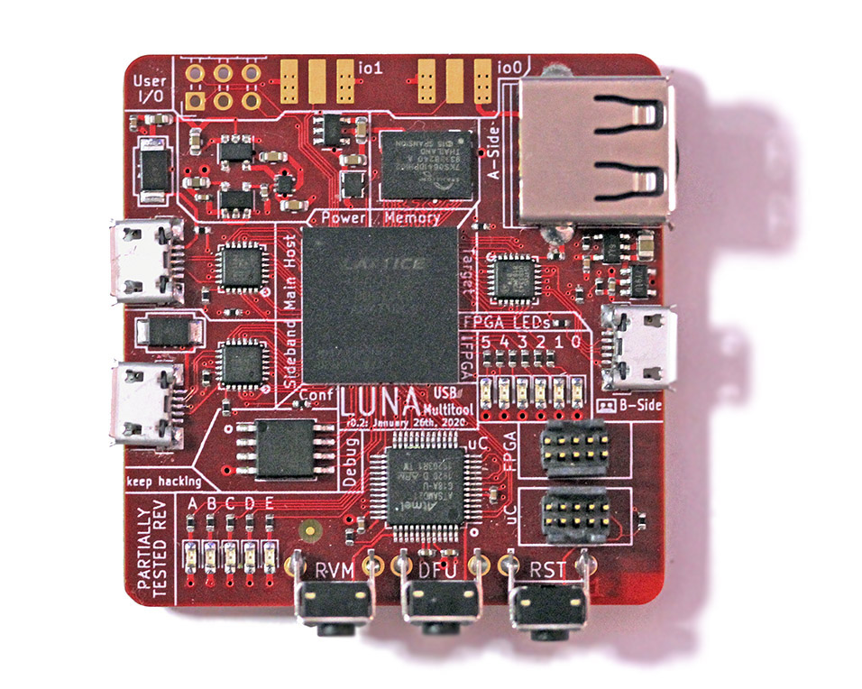

============
Introduction
============

	*Note: SOL is still a work in progress; and while much of the technology is in a usable state,
	much of its feature-set is still being built. Consider SOL an 'unstable' library, for the time being.*

Welcome to the SOL project! SOL is a full toolkit for working with USB using FPGA technology; and provides
hardware, gateware, and software to enable USB applications.

..

Some things you can use SOL for, currently:

- **Protocol analysis for Low, Full or High speed USB.** SOL provides both hardware designs and gateware that
  allow passive USB monitoring. When combined with the `ViewSB <https://github.com/usb-tools/viewsb>`__ USB analyzer
  toolkit, SOL hardware+gateware can be used as a full-featured USB analyzer.
- **Creating your own Low, Full or High speed USB device.** SOL provides a collection of Torii gateware that
  allows you to easily create USB devices in gateware, software, or a combination of the two.
- **Building USB functionality into a new or existing System-on-a-Chip (SoC).** SOL is capable of generating custom
  peripherals targeting the common Wishbone bus; allowing it to easily be integrated into SoC designs; and the library
  provides simple automation for developing simple SoC designs.

Some things you'll be able to use SOL for in the future:

- **Man-in-the-middle'ing USB communications.** The SOL toolkit will be able to act
  as a *USB proxy*, transparently modifying USB data as it flows between a host and a device.
- **USB reverse engineering and security research.** The SOL toolkit will serve as an ideal
  backend for tools like `FaceDancer <https://github.com/usb-tools/facedancer>`__; allowing easily
  emulation and rapid prototyping of compliant and non-compliant USB devices.

More detail on these features is covered in `the source <https://github.com/shrine-maiden-heavy-industries/sol>`__, and in
the remainder of this documentation.
